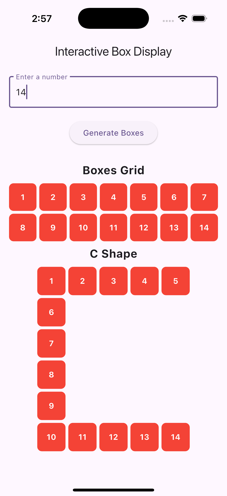
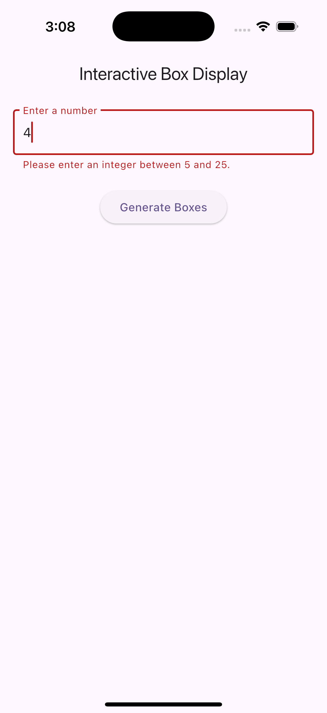

# UI Assignment

UI Development Assignment: Interactive Box Display using Flutter

**This assignment involves creating a Flutter application that displays a list of boxes with various properties and allows users to interact with them.**

  
  

